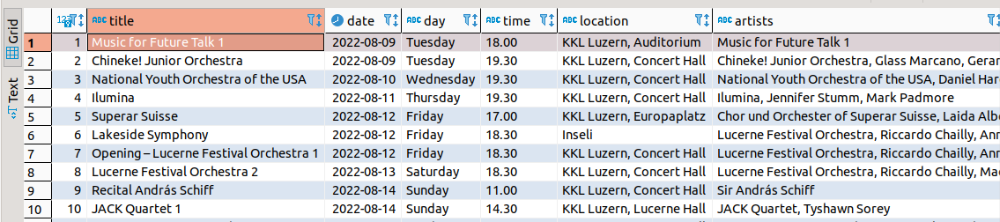
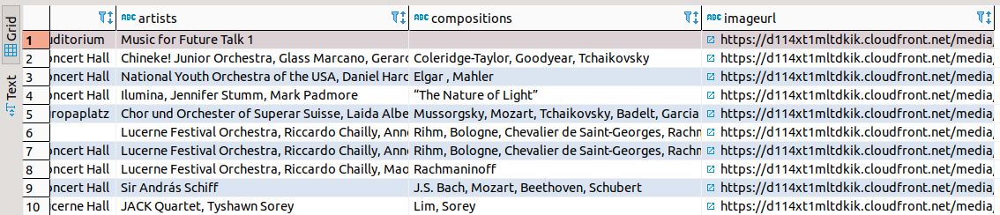

# lucerne_scraping
Scraping the [lucerne summer festival webpage](https://www.lucernefestival.ch/en/program/summer-festival-22) and storing the data in postgres database system.

To run the code, run these two commands:

`docker-compose up -d db`

`docker-compose up --build pythonapp`

The resulting database when viewed using dbeaver looks like this:
The screenshot is divided into two parts as the resulting database was not fitting on the screen. The first 10 rows are shown:

